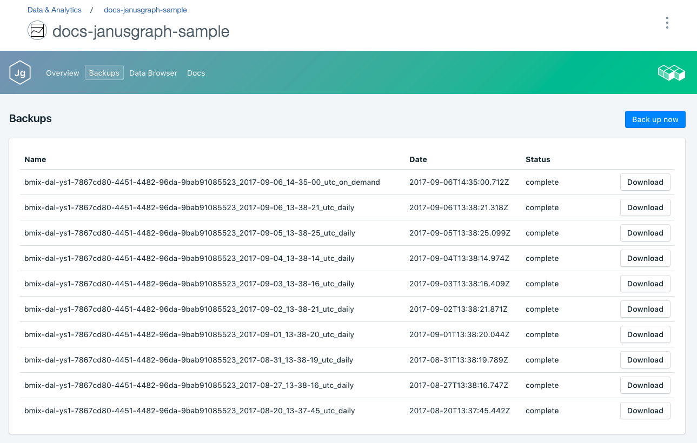

---

copyright:
  years: 2017
lastupdated: "2017-09-07"
---

{:new_window: target="_blank"}
{:shortdesc: .shortdesc}
{:screen: .screen}
{:codeblock: .codeblock}
{:pre: .pre}

# Backups
{: #backups}

You can create and download backups from the _Backups_ tab of the *Manage* page of your service dashboard. Both scheduled and manual backups are available.

Backups are created by backing up the Scylla database nodes. Scylla backups are taken using the Scylla snapshot utility, backing up all the on-disk data files stored in the data directory. The snapshot can run while your databases are on-line.

## Viewing existing backups

Daily backups of your database are automatically scheduled. To view your existing backups:

1. Navigate to the _Manage_ page of your service Dashboard.
2. Click **Backups** in the tabs to open the _Backups_ page. A list of available backups is shown, with the most recent backups at the top of the list:

  

## Creating a manual backup

As well as scheduled backups you can create a backup manually. To create a manual backup, follow the steps to view existing backups, then click **Back up now** above the list of available backups. A message is displayed to let you know that a backup has been initiated, and a 'pending' backup is added to the list of available backups.

## Downloading a backup

To download a backup, follow the steps to view existing backups, then click **Download** in the corresponding row for the backup you want to download.