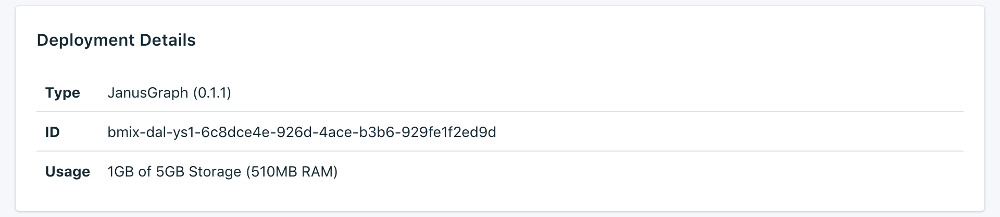

---

Copyright:
  years: 2017,2018
lastupdated: "2018-01-11"

keywords: janusgraph, compose

subcollection: compose-for-janusgraph

---

{:new_window: target="_blank"}
{:shortdesc: .shortdesc}
{:screen: .screen}
{:codeblock: .codeblock}
{:pre: .pre}

# Service Overview
{: #dashboard-overview}

The _Overview_ page shows you information about your {{site.data.keyword.cloud}} Compose database. The overview includes essential identifying information and current resource usage. It also contains a section for connection strings that you can use to connect to your database.

## Deployment Details

The _Deployment Details_ panel shows details of your service.

### Type

The type of database that is offered by the service, and the database version that your service uses. If a more recent database version is available, a notification is displayed, together with a link to the [Upgrade version](/docs/ComposeForJanusGraph?topic=compose-for-janusgraph-dashboard-settings) section of your service dashboard.

### ID

An internal identifier for the service.

### Usage

The size of your database and the amount of storage that is provided by your service plan.

## Recent Tasks

Making administrative changes to your service (such as scaling, or taking a manual backup) starts a task. While the task is running, the _Recent Tasks_ panel shows the task name and a progress bar.

## Connection Strings

Connection Strings are used to connect to your JanusGraph deployment. Detailed information about connecting is on the [Connecting with HTTP and WebSockets](/docs/ComposeForJanusGraph?topic=compose-for-janusgraph-http-websockets) and the [Connecting with the Gremlin Console](/docs/ComposeForJanusGraph?topic=compose-for-janusgraph-gremlin-console) pages.

### Session

You can use a session URI to get an authorization token that is valid for 60 minutes. Use the provided token when you make calls to the deployment with the HTTPS or Websocket URIs.

### HTTPS

HTTPS is the fundamental connection string for a JanusGraph deployment. To use an HTTPS connection string, you need to provide the admin user credentials to connect to the server.

### Websocket

The Websocket URIs can be used to establish a long-running session with the JanusGraph deployment. They are prefixed `wss:` to denote that the connections are HTTPS secured. These connection strings require basic authentication to be used with the admin user credentials to connect to the server.

A number of libraries for JanusGraph use WebSockets as their connection to the server. To work with {{site.data.keyword.composeForJanusGraph}}, they must be able to do basic authentication and use WSS (secure WebSockets over TLS).

### Gremlin Console YAML

You can use either of the configurations that are provided to connect to your deployment with the Gremlin Console.

## Instance Administration API

You can manage your {{site.data.keyword.composeForJanusGraph}} service through the {{site.data.keyword.cloud_notm}} Compose API.

### Foundation Endpoint

The foundation endpoint is composed of the region the service resides in and the service instance ID. It is at the start of every endpoint.

### Deployment ID

The deployment ID is necessary for most calls, and identifies the specific deployment instance.

### Reference

For more documentation and reference for using the {{site.data.keyword.cloud_notm}} Compose API, across all {{site.data.keyword.cloud_notm}} Compose services, read [The {{site.data.keyword.cloud_notm}} Compose API](https://www.compose.com/articles/the-ibm-cloud-compose-api/).
