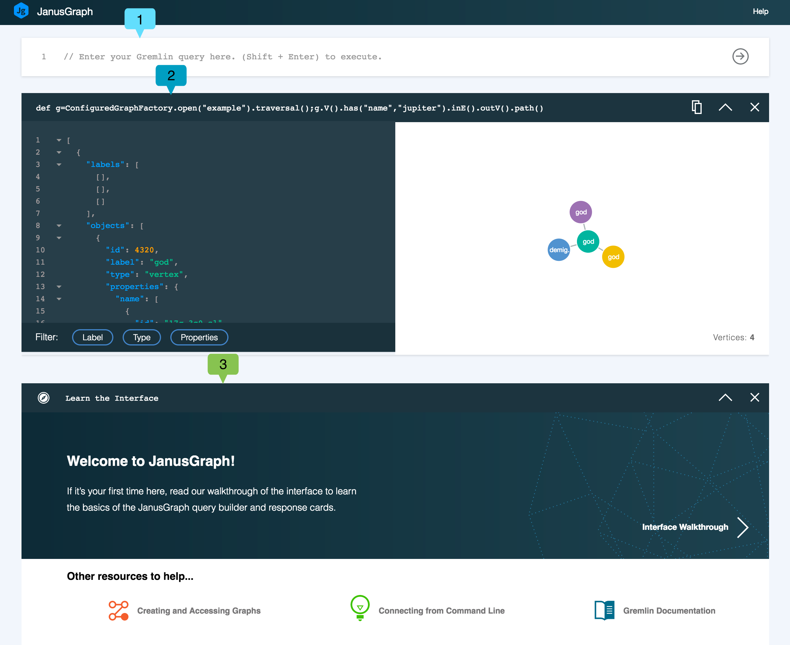
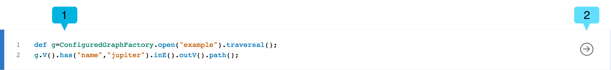
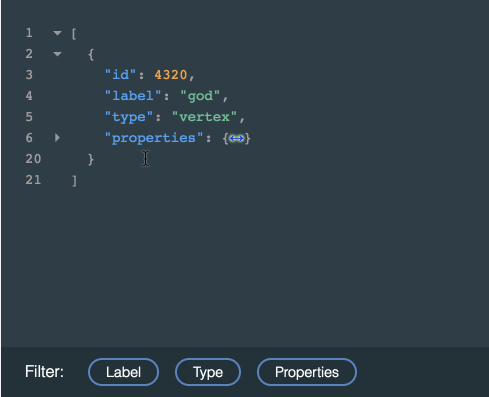
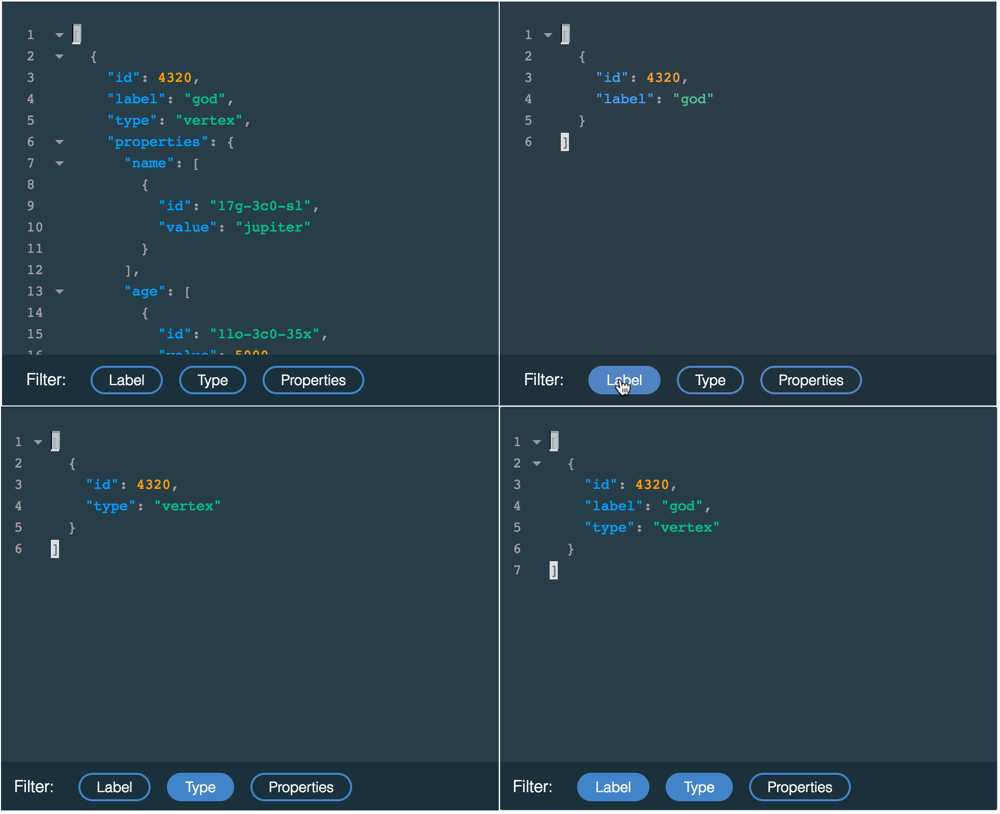
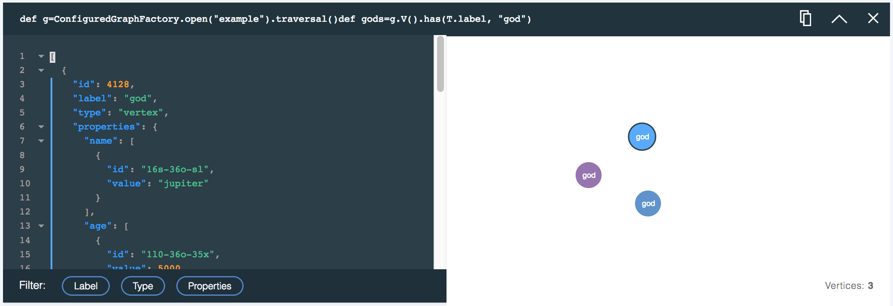
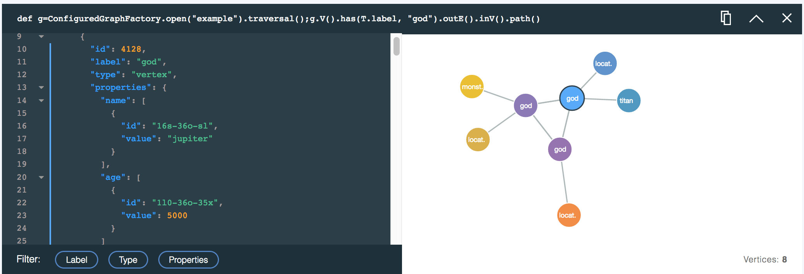
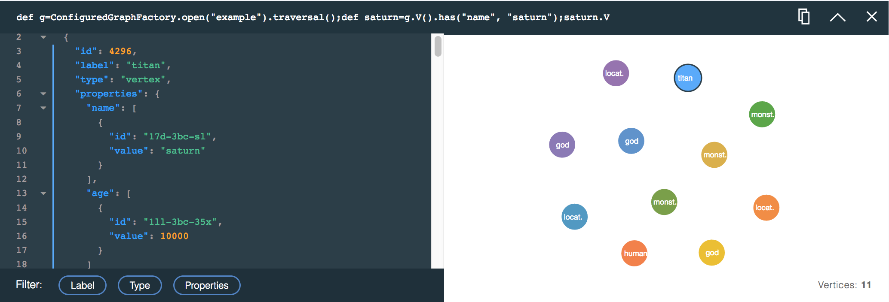

---

copyright:
  years: 2017
lastupdated: "2017-09-01"
---

{:new_window: target="_blank"}
{:shortdesc: .shortdesc}
{:screen: .screen}
{:codeblock: .codeblock}
{:pre: .pre}
{:tip: .tip}

# Using the JanusGraph Data Browser

Exploring your graph data from the command line can be a complex task, and it can be difficult to form traversals. It can be hard to visualize the results, returned as text or JSON output, in terms of digestible graph relationships. This is where the Browser for JanusGraph on Compose comes in.

The Data Browser for {{site.data.keyword.composeForJanusGraph_full}} combines an easy to use Query Builder with rich Query Response Cards that stack up below the builder. Each card records the query and displays the results both as an interactive JSON view and as a visualized graph that can be explored, relative to the JSON view. Each card can help you refine your next query.

## Getting started with the Data Browser

The link to the Data Browser is located on the _Dashboard Overview_ page of your service. Click the link to load the interface into a new browser tab.

This is a view of the Data Browser after a first query has been run.



The Data Browser shows the Query Builder **(1)**, where you create, edit and execute your queries. Below the Query Builder is a Query Response card **(2)**. New cards are inserted at the top of the card stack. The previous top card was the interactive introduction to the browser **(3)**, which is displayed when you launch the browser.

## The Query Builder

The Query Builder is a multi-line editor with syntax highlighting to help you compose Gremlin scripts.



## Response Cards and the Response Card Stack

Each query generates a response card that contains your query, a JSON response and a graph visualization of the query results if one is available. The top of each card displays the query that was run.


The card displays the query that was run **(1)**, the **Copy** button **(2)**, the **Collapse**/**Expand** button **(3)** and the **Close** button **(4)**.

As you run more queries, each generates a new response card, with the newest response card displayed first. If the page gets long, or you notice the Data Browser performance decreasing, you can use the **Collapse** button to save some frames. If you no longer need the results on a card, you can close it completely. Closing a response card does not delete any graph data.

## Query Response: The JSON viewer

The JSON viewer is a syntax-highlighted text view of the response. The lines are numbered to help you navigate through the results. Where the JSON document is nested, small arrows are displayed. You can click on the arrows to fold up the nested sections:



The JSON view also includes filters that can be applied to manage what information is displayed. To select the filters, click the **Label**, **Type** and **Properties** buttons. You can select multiple filters.



## Query Response: The Visualizer

If your query result can be visualized, the card displays a graph showing the vertices and edges from the query response. Click a vertex to see its properties. You can click and drag the vertices to move them around and lock them into position.

For example, using the Graph of the Gods sample database, a query to find vertices that have the label 'God' would be as follows:

```groovy
def g=ConfiguredGraphFactory.open("example").traversal();
g.V().has(T.label, "god");
```

The query produces the following response card and visualization, showing all the vertices in the graph that represent the gods:



The following query produces a result that shows the 'god' vertices together with any edges that go out from them, and the vertices that those edges go into:

```groovy
def g=ConfiguredGraphFactory.open("example").traversal();
g.V().has(T.label, "god").outE().inV().path();
```

The graph visualization of the query results looks like this:



### The .path() command

The visualizer renders the JSON results shown in the JSON viewer, so only the returned vertices and edges are visualized. If the query route traverses only vertices, then only vertices are returned, but if it includes edges, these are included in the results. There are a number of ways to populate the results with edges. A powerful method is to use the `path()` function. When added to a Gremlin query, `path()` returns the route taken to get to the vertices in the query response.

The Gremlin documentation on [path-step](http://tinkerpop.apache.org/docs/current/reference/#path-step) has more on the `path()` function.
{: .tip}

For example, the following query returns only vertices:

```groovy
def g=ConfiguredGraphFactory.open("example").traversal();
g.V().outE().inV()
```

The resulting visualization also contains only vertices.



You can alter the query response by adding `path()` to the same query.

```groovy
def g=ConfiguredGraphFactory.open("example").traversal();
g.V().outE().inV().path()
```

The query now produces a response that contains both vertices and edges.


## Handling 'null' results

Some commands in the browser can return a `null` result. This can happen when the value they return is not currently serializable. The most common example is any command or expression that returns a graph, including the `open` and `create` methods of the `ConfiguredGraphFactory` class. Although a `null` response is displayed, the actual values are intact within JanusGraph and are available to use in a query. When using `ConfiguredGraphFactory`, extend your command to return vertices and edges to ensure a JSON response is returned.
