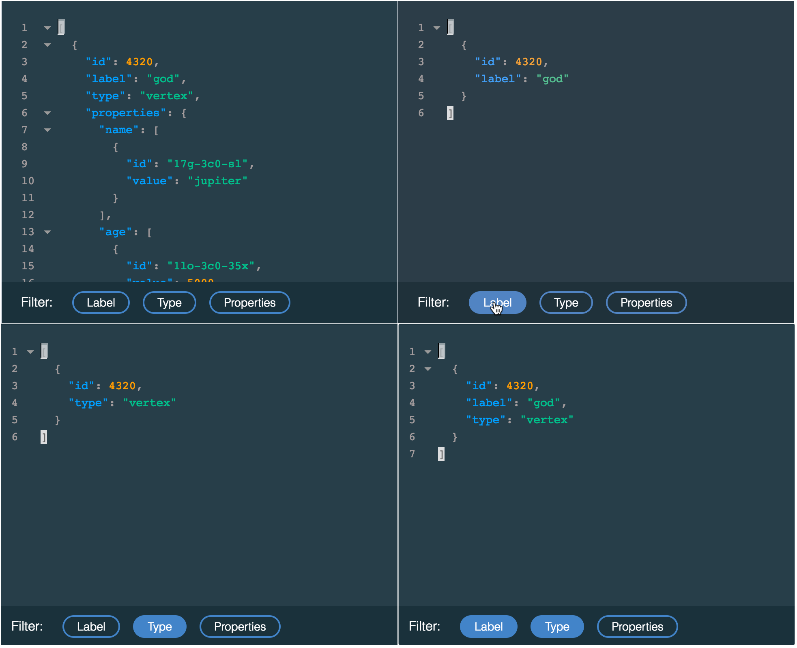
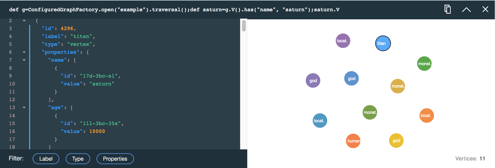

---

copyright:
  years: 2017
lastupdated: "2017-09-01"
---

{:new_window: target="_blank"}
{:shortdesc: .shortdesc}
{:screen: .screen}
{:codeblock: .codeblock}
{:pre: .pre}
{:tip: .tip}

# JanusGraph-Datenbrowser verwenden

Die Untersuchung Ihrer Diagrammdaten über die Befehlszeile kann eine komplexe Aufgabe darstellen und es kann schwer sein, Traversierungen zu bilden. Es kann schwierig sein, die als Text oder JSON-Ausgabe zurückgegebenen Ergebnisse in Form von verständlichen Diagrammbeziehungen darzustellen. An dieser Stelle kommt der Browser für JanusGraph on Compose ins Spiel.

Der Datenbrowser für {{site.data.keyword.composeForJanusGraph_full}} verbindet einen benutzerfreundlichen Abfragebuilder mit umfangreichen Abfrageantwortkarten, die unter dem Builder gestapelt werden. Die einzelnen Karten zeichnen die Abfrage auf und zeigen die Ergebnisse sowohl als interaktive JSON-Ansicht als auch als visualisiertes Diagramm an, das relativ zu der JSON-Ansicht untersucht werden kann. Jede Karte trägt dazu bei, dass Sie Ihre nächste Abfrage präzisieren.

## Einführung in den Datenbrowser

Der Link zum Datenbrowser befindet sich auf der Seite _Dashboardübersicht_ Ihres Service. Klicken Sie auf den Link, um die Schnittstelle auf einer neuen Browserregisterkarte zu laden.

Nachstehend finden Sie eine Ansicht des Datenbrowsers nach der Ausführung einer ersten Abfrage.


Der Datenbrowser zeigt den Abfragebuilder **(1)** an, in dem Sie Ihre Abfragen erstellen, bearbeiten und ausführen. Unter dem Abfragebuilder befindet sich eine Abfrageantwortkarte **(2)**. Neue Karten werden oben auf dem Kartenstapel eingefügt. Die vorige oberste Karte war die interaktive Einführung in den Browser **(3)**, die beim Start des Browsers angezeigt wird.

## Abfragebuilder

Der Abfragebuilder ist ein mehrzeiliger Editor mit Syntaxhervorhebung, der Sie beim Erstellen von Gremlin-Scripts unterstützt.


## Antwortkarten und Antwortkartenstapel

Jede Abfrage generiert eine Antwortkarte, die Ihre Abfrage, eine JSON-Antwort und eine grafische Darstellung der Abfrageergebnisse enthält, sofern verfügbar. Oben auf jeder Karte wird die Abfrage angezeigt, die ausgeführt wurde.


Die Karte zeigt die ausgeführte Abfrage **(1)**, die Schaltfläche **Kopieren** **(2)**, die Schaltfläche **Ausblenden**/**Einblenden** **(3)** und die Schaltfläche **Schließen** **(4)** an.

Bei der Ausführung jeder weiteren Abfrage wird eine neue Antwortkarte erstellt, wobei die neueste Antwortkarte ganz oben angezeigt wird. Wenn die Seite lang wird oder Sie feststellen, dass die Leistung des Datenbrowsers sinkt, können Sie mit der Schaltfläche **Ausblenden** einige Rahmen speichern. Wenn Sie die Ergebnisse auf einer Karte nicht mehr brauchen, können Sie sie ganz schließen. Beim Schließen einer Antwortkarte werden keine Diagrammdaten gelöscht.

## Abfrageantwort: JSON-Viewer

Der JSON-Viewer ist eine Textansicht der Antwort mit Syntaxhervorhebung. Die Zeilen sind nummeriert, um Ihnen das Navigieren in den Ergebnissen zu erleichtern. Wo das JSON-Dokument verschachtelt ist, werden kleine Pfeile angezeigt. Durch Klicken auf die Pfeile können Sie die verschachtelten Bereiche auffalten:


Die JSON-Ansicht umfasst auch Filter, mit deren Hilfe Sie bestimmen können, welche Informationen angezeigt werden. Klicken Sie zur Auswahl der Filter auf die Schaltflächen **Bezeichnung**, **Typ** und **Eigenschaften**. Sie können mehrere Filter auswählen.



## Abfrageantwort: Visualizer

Wenn Ihre Abfrageantwort visualisiert werden kann, zeigt die Karte ein Diagramm mit den Vertices und Kanten aus der Abfrageantwort an. Klicken Sie auf einen Vertex, um dessen Eigenschaften anzuzeigen Durch Klicken und Ziehen können Sie die Vertices verschieben und positionieren.

Beispiel: Bei Verwendung der Beispieldatenbank 'Graph of the Gods' sieht eine Abfrage zum Suchen von Vertices mit der Bezeichnung 'God' wie folgt aus:

```groovy
def g=ConfiguredGraphFactory.open("example").traversal();
g.V().has(T.label, "god");
```

Die Abfrage generiert die folgende Antwortkarte und Darstellung, wobei alle Vertices im Diagramm angezeigt werden, die 'god'-Vertices darstellen:


Die folgende Abfrage generiert ein Ergebnis, das die 'god'-Vertices sowie alle Kanten, die von ihnen ausgehen, und die Vertices, in die diese Kanten hineinlaufen, anzeigt:

```groovy
def g=ConfiguredGraphFactory.open("example").traversal();
g.V().has(T.label, "god").outE().inV().path();
```

Die grafische Darstellung der Abfrageergebnisse sieht wie folgt aus:


### Befehl .path()

Da der Visualizer die im JSON-Viewer gezeigten JSON-Ergebnisse wiedergibt, werden nur die zurückgegebenen Vertices und Kanten visualisiert. Wenn die Abfrageroute nur Vertices traversiert, werden nur Vertices zurückgegeben, aber wenn sie Kanten enthält, werden diese in die Ergebnisse eingebunden. Es gibt verschiedene Möglichkeiten, die Ergebnisse mit Kanten zu füllen. Eine leistungsfähige Methode ist die Verwendung der Funktion `path()`. Wird `path()` zu einer Gremlin-Abfrage hinzugefügt, wird die Route zurückgegeben, die zu den Vertices in der Abfrageantwort führt.

Weitere Informationen zur Funktion `path()` finden Sie in der Gremlin-Dokumentation zu [path-step](http://tinkerpop.apache.org/docs/current/reference/#path-step).
{: .tip}

Die folgende Abfrage gibt beispielsweise nur Vertices zurück:

```groovy
def g=ConfiguredGraphFactory.open("example").traversal();
g.V().outE().inV()
```

Die resultierende Darstellung enthält ebenfalls nur Vertices.



Sie können die Abfrageantwort ändern, indem Sie `path()` zu derselben Abfrage hinzufügen.

```groovy
def g=ConfiguredGraphFactory.open("example").traversal();
g.V().outE().inV().path()
```

Nun generiert die Abfrage eine Antwort, die sowohl Vertices als auch Kanten enthält.


## Umgang mit 'null'-Ergebnissen

Einige Befehle im Browser können ein `null`-Ergebnis zurückgeben. Dies kann passieren, wenn der Wert, den sie zurückgeben, gerade nicht serialisierbar ist. Das häufigste Beispiel ist ein beliebiger Befehl oder Ausdruck, der ein Diagramm zurückgibt, einschließlich der Methoden `open` und `create` der Klasse `ConfiguredGraphFactory`. Obwohl eine `null`-Antwort angezeigt wird, sind die tatsächlichen Werte innerhalb von JanusGraph intakt und stehen zur Verwendung in einer Abfrage zur Verfügung. Erweitern Sie bei Verwendung von `ConfiguredGraphFactory` Ihren Befehl so, dass Vertices und Kanten zurückgegeben werden, um sicherzustellen, dass eine JSON-Antwort zurückgegeben wird.
