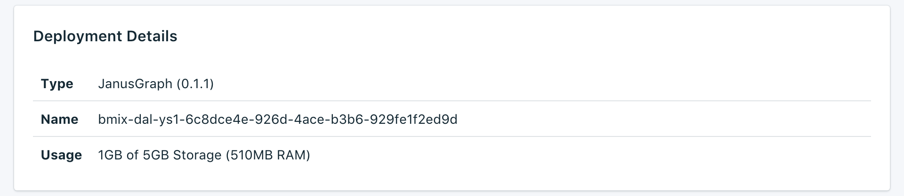

---

Copyright:
  Years: 2017
lastupdated: "2017-09-05"
---

{:new_window: target="_blank"}
{:shortdesc: .shortdesc}
{:screen: .screen}
{:codeblock: .codeblock}
{:pre: .pre}

# Visión general del servicio

La página _Visión general_ muestra información sobre la base de datos de {{site.data.keyword.cloud}} Compose. La visión general incluye información de identificación esencial y el uso actual de recursos. También encontrará una sección correspondiente a las series de conexión que puede utilizar con las herramientas o las herramientas que puede usar para conectarse a la base de datos.

## Detalles de despliegue

El panel _Detalles de despliegue_ muestra detalles del servicio.

### Tipo

El tipo de base de datos que ofrece el servicio y la versión de la base de datos que utiliza el servicio.

### Nombre

Un identificador interno para el servicio.

### Uso

El tamaño de la base de datos y la cantidad de almacenamiento que proporciona su plan de servicio.

## Series de conexión

Algunas bibliotecas de cliente pueden utilizar series de conexión, que contienen toda la información necesaria para que se conecten otras bibliotecas. Encontrará información sobre cómo utilizar una serie de conexión para conectar al servicio en el apartado [Conexión de una aplicación externa](./connecting-external.html).

Encontrará cada serie de conexión para el servicio en un separador diferente en el panel _Series de conexión_.

### Sesión

Puede utilizar un URI de sesión para obtener una señal de autorización que es válido durante 60 minutos. Debe utilizar la señal proporcionada cuando realice llamadas al despliegue utilizando los URI Websocket o HTTPS.

### HTTPS

Esta es la serie de conexión fundamental para un despliegue JanusGraph. Para utilizar una serie de conexión HTTPS, debe proporcionar las credenciales de usuario de administración para conectar con el servidor. Para ver detalles sobre cómo utilizar HTTPs, consulte [Creación y cruce de un gráfico mediante HTTPs](./tutorial-https.html).

### Websocket

Se pueden utilizar los URI Websocket para establecer una sesión de larga ejecución con el despliegue de JanusGraph. Van precedidos de `wss:` para indicar que las conexiones tendrán protección de HTTPS. Estas series de conexión requieren que se utilice la autenticación básica con las credenciales de usuario de administración para conectar con el servidor.

Hay varias bibliotecas para JanusGraph que utilizan WebSockets como método de conexión con el servidor; para trabajar con {{site.data.keyword.composeForJanusGraph}}, deben ser capaces de realizar una autenticación básica y de utilizar WSS (WebSockets seguro sobre TLS).

### YAML de la consola de Gremlin

Puede utilizar cualquiera de las configuraciones proporcionadas para conectarse a {{site.data.keyword.composeForJanusGraph}} utilizando la consola de Gremlin. Para obtener más información sobre cómo utilizar el YAML de la consola de Gremlin, consulte [Creación y cruce de un gráfico mediante la consola de Gremlin](./tutorial-gremlin-console.html).
