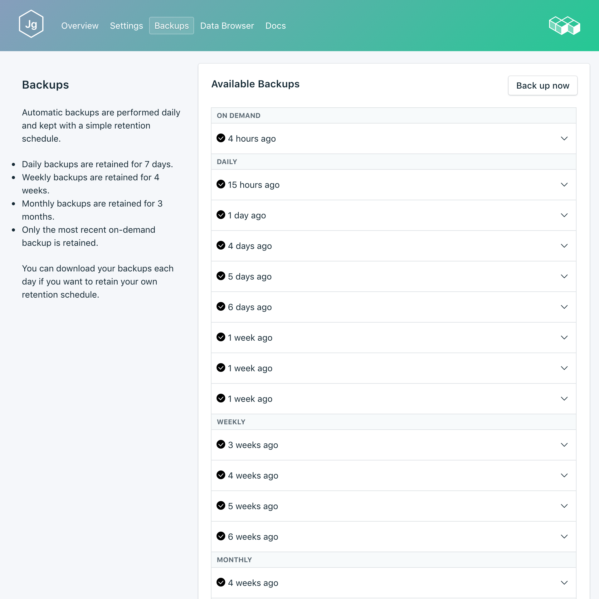
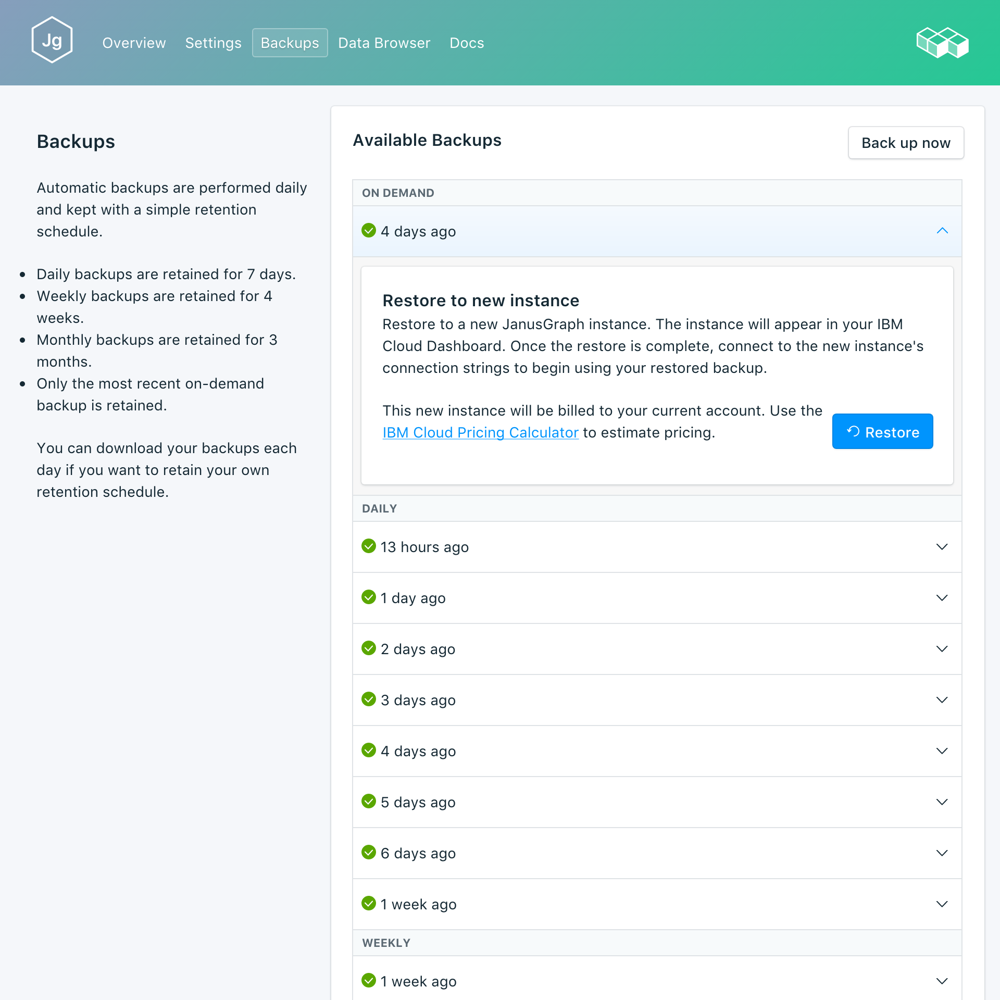

---

copyright:
  years: 2017
lastupdated: "2017-10-16"
---

{:new_window: target="_blank"}
{:shortdesc: .shortdesc}
{:screen: .screen}
{:codeblock: .codeblock}
{:pre: .pre}

# Sauvegardes
{: #backups}

Vous pouvez créer et télécharger des sauvegardes à partir de l'onglet _Backups_ de la page *Gérer* du tableau de bord de votre service. Les sauvegardes planifiées comme manuelles sont disponibles.

Les sauvegardes sont créées en sauvegardant les noeuds de la base de données Scylla. Les sauvegardes Scylla sont effectuées à l'aide de l'utilitaire d'instantané Scylla, qui sauvegarde tous les fichiers de données sur disque stockés dans le répertoire de données. L'instantané peut s'exécuter pendant que vos bases de données sont connectées.

## Affichage des sauvegardes existantes

Des sauvegardes quotidiennes de votre base de données sont automatiquement planifiées. Pour afficher vos sauvegardes existantes :

1. Accédez à la page _Gérer_ du tableau de bord de votre service.
2. Cliquez sur l'onglet **Backups** pour ouvrir la page _Backups_. La liste des sauvegardes disponibles s'affiche avec la plus récente en tête de liste :

  

Cliquez sur la ligne correspondante pour développer les options de chaque sauvegarde disponible.
   

## Création d'une sauvegarde manuelle

Outre les sauvegardes planifiées, vous pouvez créer une sauvegarde manuelle. Pour créer une sauvegarde manuelle, suivez la procédure d'affichage des sauvegardes existantes, puis cliquez sur **Back up now** au-dessus de la liste des sauvegardes disponibles. Un message indiquant qu'une sauvegarde a été initiée s'affiche et une sauvegarde en attente (pending) est ajoutée à la liste des sauvegardes disponibles.

## Restauration d'une sauvegarde
Pour restaurer une sauvegarde sur une nouvelle instance de service, suivez la procédure d'affichage des sauvegardes, puis cliquez sur la ligne correspondante afin de développer les options de la sauvegarde que vous voulez télécharger. Cliquez sur le bouton **Restore**. Un message vous indiquant qu'une restauration a été initiée s'affiche. La nouvelle instance de service sera automatiquement nommée "janusgraph-restore-[timestamp]" ; elle s'affiche dans votre tableau de bord au démarrage de la mise à disposition.
