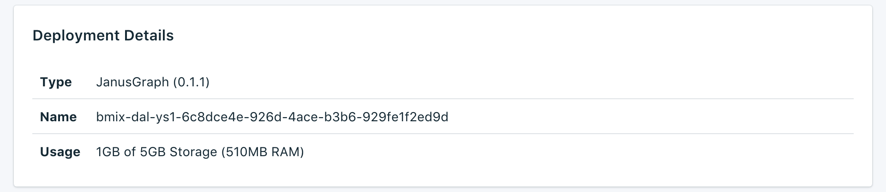

---

Copyright:
  years: 2017,2018
lastupdated: "2018-05-07"
---

{:new_window: target="_blank"}
{:shortdesc: .shortdesc}
{:screen: .screen}
{:codeblock: .codeblock}
{:pre: .pre}

# Présentation du service

La page _Vue d'ensemble_ affiche des informations concernant la base de données Compose d'{{site.data.keyword.cloud}}. La vue d'ensemble contient des informations d'identification essentielles et indique l'utilisation actuelle des ressources. Vous y trouverez également une section qui contient les chaînes de connexion que vous pouvez utiliser avec les outils pour vous connecter à votre base de données.

## Deployment Details

Le panneau _Deployment Details_ affiche des détails concernant votre déploiement.

### Type

Type de base de données fourni par le service et version de base de données qu'utilise votre service. Lorsqu'une version plus récente de la base de données est disponible, une notification s'affiche, accompagnée d'un lien vers la section [Mise à niveau de la version](/docs/services/ComposeForJanusGraph/dashboard-settings.html#upgrade-version) du tableau de bord de votre service.

### ID

Identificateur interne du service.

### Utilisation

Taille de votre base de données et quantité de stockage fournie par le plan de service.

## Travaux en cours

Toute modification administrative (telle une mise à l'échelle ou une sauvegarde manuelle) démarre un travail. Pendant l'exécution d'un travail, le panneau _Current Jobs_, qui indique le nom du travail et présente une barre de progression, s'affiche sur la page _Vue d'ensemble_. Une fois le travail achevé, le panneau _Current Jobs_ disparaît de la page _Vue d'ensemble_.

## Chaînes de connexion

Les chaînes de connexion peuvent être utilisées par certaines bibliothèques client et contiennent toutes les informations nécessaires pour que d'autres bibliothèques se connectent. Pour savoir comment utiliser une chaîne de connexion pour vous connecter à votre service, voir [Connexion d'une application externe](./connecting-external.html).

Chaque chaîne de connexion pour votre service se trouve dans un onglet distinct du panneau _Chaînes de connexion_.

### Session

Vous pouvez utiliser un identificateur URI de session pour obtenir un jeton d'autorisation valable pendant 60 minutes. Vous devez utiliser le jeton fourni lors des appels au déploiement à l'aide d'identificateurs URI HTTPS ou Websocket.

### HTTPS

Il s'agit de la chaîne de connexion fondamentale pour un déploiement JanusGraph. Pour utiliser une chaîne de connexion HTTPS vous devez fournir les données d'identification d'administrateur pour la connexion au serveur. Pour plus d'informations sur la manière d'utiliser de HTTPS, voir [Création et traversée d'un graphique à l'aide de HTTPS](./tutorial-https.html).

### Websocket

Les URI Websocket peuvent être utilisés pour établir une session à exécution longue avec le déploiement JanusGraph. Il sont préfixés `wss:` pour indiquer que la connexion sera sécurisée via HTTPS. Ces chaînes de connexion nécessitent d'utiliser une authentification de base avec les mêmes données d'identification d'administrateur pour la connexion au serveur.

Un grand nombre des bibliothèques pour JanusGraph utilisent des WebSockets comme connexion au serveur ; pour utiliser {{site.data.keyword.composeForJanusGraph}} elles doivent pouvoir effectuer une authentification de base et utiliser WSS, WebSockets sécurisés via TLS.

### Console YAML Gremlin

Vous pouvez utiliser n'importe laquelle des configurations fournies pour vous connecter à {{site.data.keyword.composeForJanusGraph}} à l'aide de la console Gremlin. Pour plus d'informations sur l'utilisation de la console YAML Gremlin, voir [Création et traversée d'un graphique à l'aide de la console Gremlin](./tutorial-gremlin-console.html).

## API d'administration d'instance

Vous pouvez gérer votre service {{site.data.keyword.composeForJanusGraph}} via l'API {{site.data.keyword.cloud_notm}} Compose.

### Noeud final Foundation

Le noeud final Foundation est composé de la région où réside le service et de l'ID d'instance du service. Il se trouvera au début de chaque noeud final.

### ID de déploiement

L'ID de déploiement est nécessaire pour la plupart des appels ; il identifie l'instance de déploiement spécifique.

### Référence

Pour plus de documentation et de référence sur l'utilisation de l'API {{site.data.keyword.cloud_notm}} Compose au sein de tous les services {{site.data.keyword.cloud_notm}} Compose, voir [API {{site.data.keyword.cloud_notm}} Compose](https://www.compose.com/articles/the-ibm-cloud-compose-api/).
