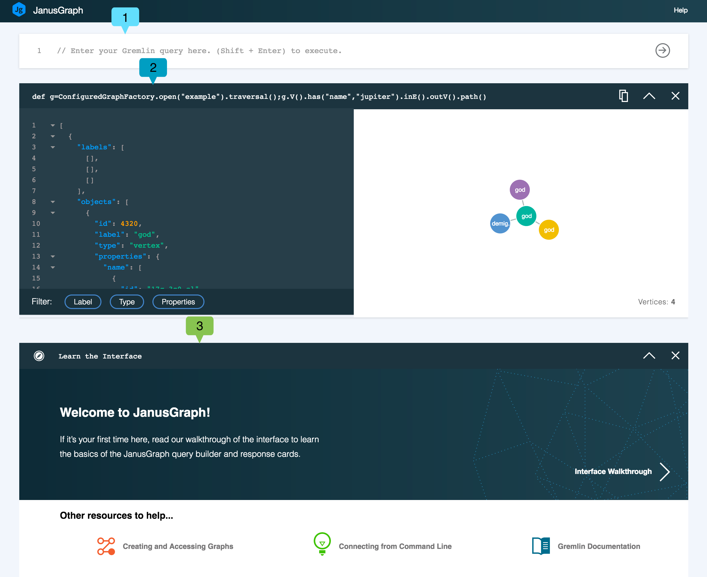
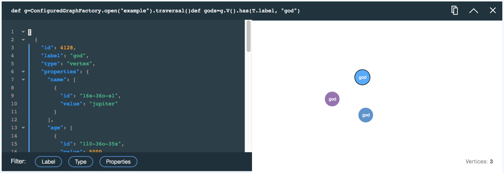

---

copyright:
  years: 2017,2018
lastupdated: "2017-09-01"
---

{:new_window: target="_blank"}
{:shortdesc: .shortdesc}
{:screen: .screen}
{:codeblock: .codeblock}
{:pre: .pre}
{:tip: .tip}

# Utilisation du navigateur de données de JanusGraph

Explorer votre graphique de données à partir de la ligne de commande peut se révéler une tâche complexe et la constitution des traversées s'avérer difficile. La visualisation des résultats, renvoyés sous forme de texte ou de sortie JSON peut ne pas être aisée à visualiser, s'agissant de relations graphiques assimilables. C'est là où intervient le navigateur de JanusGraph sur Compose.

Le navigateur de données de {{site.data.keyword.composeForJanusGraph_full}} combine un générateur de requête facile à utiliser et des cartes de réponse de requête qui s'empilent sous le générateur. Chaque carte enregistre la requête et affiche les résultats à la fois comme une vue JSON interactive et comme une visualisation graphique pouvant être explorée, par rapport à la vue JSON. Chaque carte peut vous aider à affiner votre requête suivante.

## Initiation au navigateur de données

Le lien d'accès au navigateur de données se trouve sur la page _Dashboard Overview_ de votre service. Cliquez sur le lien pour charger l'interface dans n nouvel onglet de navigateur.

Voici une vue du navigateur de données près exécution de la première requête.




Le navigateur de données affiche le générateur de requête **(1)**, dans lequel vous créez, éditez et exécutez vos requêtes. Sous le générateur de requête se trouve une carte de réponse de requête **(2)**. Les nouvelles cartes sont insérées en haut de la pile de cartes. La carte du haut précédente était une introduction interactive au navigateur **(3)**, qui s'affiche lorsque vous lancez le navigateur.

## Générateur de requête

Le générateur de requête est un éditeur multiligne avec mise en évidence de syntaxe pour vous aider à composer des scripts Gremlin.


## Cartes de réponse et pile de cartes de réponse

Chaque requête génère une carte de réponse qui contient votre requête, une réponse JSON et une visualisation graphique des résultats de la requête si elle est disponible. La dernière requête exécutée figure en haut de chaque pile.


La carte affiche la requête qui a été exécutée **(1)**, le bouton **Copier** **(2)**, le bouton **Réduire**/**Développer** **(3)** et le bouton **Fermer** **(4)**.

A mesure que vous exécutez d'autres requêtes, une nouvelle carte de réponse est générée ; elle s'affiche en premier dans la pile. Si la page devient trop longue, ou si vous remarquez que les performances du navigateur de données diminuent, vous pouvez utiliser le bouton**Réduire** pour sauvegarder certaines trames. Si vous n'avez plus besoin des résultats que contient une carte, vous pouvez la fermer complètement. La fermeture d'une carte de réponse ne supprime aucune donnée graphique.

## Réponse de requête : Afficheur JSON

L'afficheur JSON est une vue texte de la réponse avec mise en évidence de syntaxe. Les lignes sont numérotées pour vous aider à naviguer dans les résultats. Lorsqu'un document JSON est imbriqué, de petites flèches s'affichent. Cliquez sur les flèches pour plier les sections imbriquées :


La vue JSON inclut également des filtres que vous pouvez appliquer pour gérer quelles informations afficher. Pour sélectionner les filtres, cliquez sur les boutons **Libellé**, **Type** et **Propriétés**. Vous pouvez sélectionner plusieurs filtres.


## Réponse de requête : Visualiseur

Si votre résultat de requête peut être visualisé, la carte affiche un graphique représentant les sommets et arêtes issus de la réponse de requête. Cliquez sur un vertex pour afficher ses propriétés. Vous pouvez cliquer et faire glisser les sommets pour les déplacer et les verrouiller sur une position.

Par exemple, avec l'exemple de base de données Graph of the Gods, une requête pour rechercher les sommets ayant pour libellé 'God' se présente comme suit :

```groovy
def g=ConfiguredGraphFactory.open("example").traversal();
g.V().has(T.label, "god");
```

La requête génère la carte de réponse et la visualisation suivantes, affichant tous les sommets du graphique qui représentent des dieux :



La requête suivante génère un résultat qui montre les sommets 'god' et toutes les arêtes partant de ces sommets ainsi que les sommets vers lesquels vont ces arêtes :

```groovy
def g=ConfiguredGraphFactory.open("example").traversal();
g.V().has(T.label, "god").outE().inV().path();
```

La visualisation graphique des résultats de la requête se présente comme suit :


### Fonction .path()

Le visualiseur renvoie les résultats JSON présentés dans le visualiseur JSON, de sorte que seuls les sommets et les arêtes renvoyés sont visualisés. Si la route de la requête traverse uniquement des sommets, seuls les sommets sont renvoyés, mais si elle inclut des arêtes, ces dernières sont incluses dans les résultats. Il existe différentes méthodes pour inclure les arêtes dans les résultats. Une méthode puissante consiste à utiliser la fonction `path()`. Ajoutée à une requête Gremlin, la fonction `path()` renvoie la route empruntée pour obtenir les sommets dans la réponse de requête.

La documentation Gremlin sur [path-step](http://tinkerpop.apache.org/docs/current/reference/#path-step) fournit plus d'informations sur la fonction `path()`.
{: .tip}

Par exemple, la requête suivante ne renvoie que des sommets :

```groovy
def g=ConfiguredGraphFactory.open("example").traversal();
g.V().outE().inV()
```

La visualisation qui en résulte contient également uniquement des sommets.


Vous pouvez modifier la réponse de requête en ajoutant `path()` à la même requête.

```groovy
def g=ConfiguredGraphFactory.open("example").traversal();
g.V().outE().inV().path()
```

La requête génère maintenant un réponse qui contient à la fois les sommets et les arêtes.


## Gestion des résultats 'null'

Certaines commandes du navigateur peuvent renvoyer un résultat `null`. C'est notamment le cas lorsque la valeur qu'elles renvoient n'est pas sérialisable actuellement. L'exemple le plus courant est celui d'une commande ou d'une expression qui renvoie un graphique, incluant les méthodes `open` et `create` de la classe `ConfiguredGraphFactory`. Même si une réponse `null` est affichée, les valeurs réelles sont intactes dans JanusGraph et disponibles pour utilisation dans une requête. Lorsque vous utilisez `ConfiguredGraphFactory`, développez votre commande pour renvoyer des sommets et des arrêtes afin de garantir qu'une réponse JSON est renvoyée.
