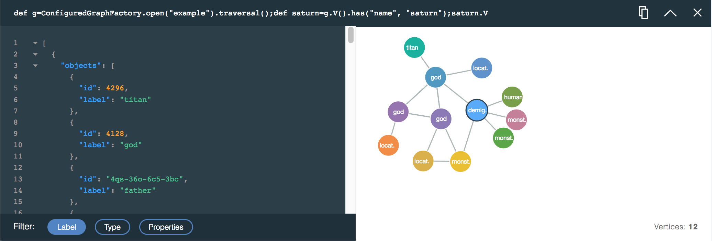

---

copyright:
  years: 2017
lastupdated: "2017-09-01"
---

{:new_window: target="_blank"}
{:shortdesc: .shortdesc}
{:screen: .screen}
{:codeblock: .codeblock}
{:pre: .pre}
{:tip: .tip}

# JanusGraph データ・ブラウザーの使用

コマンド・ラインからのグラフ・データの探索は複雑な作業になることがあり、トラバーサルになりにくい場合があります。要約しやすいグラフの関係という点で、テキストまたは JSON 出力として返された結果を視覚化するのは難しいことがあります。ここで、Browser for JanusGraph on Compose の登場です。

Data Browser for {{site.data.keyword.composeForJanusGraph_full}} は、使いやすい Query Builder と、ビルダーの下にスタックされる多機能の照会応答カードを結合します。各カードは照会を記録し、対話式 JSON ビューとしても、JSON ビューと比較して探索しやすい視覚化グラフとしても、結果を表示します。各カードは次の照会を洗練するのに役立ちます。

## Data Browser の概説

Data Browser へのリンクはサービスの _「ダッシュボードの概要 (Dashboard Overview)」_ページにあります。このリンクをクリックすると、新しいブラウザー・タブにインターフェースがロードされます。

これは、最初の照会が実行された後の Data Browser のビューです。


Data Browser には、照会を作成、編集、実行できる Query Builder **(1)** が表示されています。Query Builder の下に照会応答カード **(2)** が表示されます。新しいカードはカード・スタックの先頭に挿入されます。それまで先頭にあったカードはブラウザー **(3)** の対話式概要だったカードで、ブラウザーを起動すると表示されます。

## Query Builder

Query Builder は構文強調表示機能を備えた複数行エディターであり、Gremlin スクリプトの作成を支援します。


## 応答カードと応答カード・スタック

照会ごとに応答カードが生成されます。応答カードには、照会、JSON 応答と、可能であれば照会結果のグラフ視覚化が含まれます。各カードの先頭に、実行された照会が表示されます。


カードには、実行された照会 **(1)**、**「コピー」**ボタン **(2)**、**「省略」**/**「展開」**ボタン **(3)**、**「閉じる」**ボタン **(4)** が表示されています。

さらに照会を実行すると、照会ごとに新しい応答カードが生成され、最新の応答カードが最初に表示されます。ページが長くなった場合や、Data Browser のパフォーマンスが低下していると思われる場合は、**「省略」**ボタンを使用することで、いくつかのフレームを省略できます。カード上の結果が不要になったら、カードを完全に閉じることができます。応答カードを閉じてもグラフ・データは削除されません。

## 照会応答: JSON ビューアー

JSON ビューアーは、応答の構文強調表示型テキスト・ビューです。結果をナビゲートしやすいように、行に番号が付けられます。JSON 文書がネストされているところでは、小さい矢印が表示されます。矢印をクリックして、ネストされているセクションを折り畳むことができます。


JSON ビューには、表示情報の管理に適用できるフィルターも含まれています。フィルターを選択するには、**「ラベル」**ボタン、**「タイプ」**ボタン、**「プロパティー」**ボタンをクリックします。複数のフィルターを選択できます。


## 照会応答: Visualizer

照会結果を視覚化できる場合は、照会応答から得られた頂点とりょう線を示すグラフがカードに表示されます。頂点をクリックすると、そのプロパティーが表示されます。頂点をクリックしてドラッグすることにより、頂点を移動して目的の位置にロックすることができます。

例えば、Gods サンプル・データベースのグラフを使用している場合、「God」というラベルの頂点を見つける照会は、次のようになります。

```groovy
def g=ConfiguredGraphFactory.open("example").traversal();
g.V().has(T.label, "god");
```

この照会により次の応答カードと視覚化が生成され、god を表すグラフ内の頂点がすべて示されます。


次の照会では、「god」頂点を、そこから出るりょう線、それらのりょう線が入る頂点とともに示す結果が生成されます。

```groovy
def g=ConfiguredGraphFactory.open("example").traversal();
g.V().has(T.label, "god").outE().inV().path();
```

照会結果のグラフ視覚化は、次のようになります。


### .path() コマンド

Visualizer は JSON ビューアーに表示される JSON 結果をレンダリングするため、返された頂点とりょう線のみが視覚化されます。照会経路で頂点のみがトラバースされた場合は、頂点のみが返されますが、りょう線が含まれる場合は、結果にりょう線が含まれます。結果にりょう線を取り込むには、いくつかの方法があります。強力な方法は `path()` 関数を使用することです。Gremlin 照会に追加すると、`path()` は、照会応答に含まれる頂点に到達するためにたどる経路を返します。

[path-step](http://tinkerpop.apache.org/docs/current/reference/#path-step) の Gremlin 文書に、`path()` 関数について詳細に記載されています。
{: .tip}

例えば、次の照会は頂点のみ返します。

```groovy
def g=ConfiguredGraphFactory.open("example").traversal();
g.V().outE().inV()
```

結果の視覚化にも、頂点のみが含まれます。


同じ照会に `path()` を追加することにより、照会応答を変更できます。

```groovy
def g=ConfiguredGraphFactory.open("example").traversal();
g.V().outE().inV().path()
```

これで、照会は頂点とりょう線の両方を含む応答を生成するようになりました。



## 「null」結果の扱い

ブラウザーのいくつかのコマンドは `null` 結果を返すことがあります。これは、返される値が現在シリアライズ可能でない場合に起こります。最も一般的な例は、グラフを返すコマンドまたは式のうち、`ConfiguredGraphFactory` クラスの `open` メソッドと `create` メソッドを含むものです。`null` 応答が表示されても、実際の値は JanusGraph 内で損なわれておらず、照会で使用できます。`ConfiguredGraphFactory` を使用する際は、頂点とりょう線を返すようにコマンドを拡張して、JSON 応答が返されるようにしてください。
