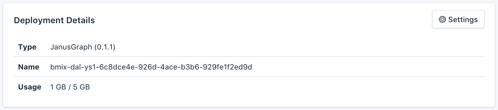

---

Copyright:
  Years: 2017
lastupdated: "2017-09-05"
---

{:new_window: target="_blank"}
{:shortdesc: .shortdesc}
{:screen: .screen}
{:codeblock: .codeblock}
{:pre: .pre}

# 서비스 개요

_개요_ 페이지에는 {{site.data.keyword.cloud}} Compose 데이터베이스에 대한 정보가 표시됩니다. 개요에는 필수 식별 정보와 현재 리소스 사용량이 포함되어 있습니다. 또한 도구와 함께 사용하거나 도구를 활용하여 데이터베이스에 연결할 수 있는 연결 문자열에 대한 섹션도 찾을 수 있습니다.

## 배치 세부사항

_배치 세부사항_ 패널에는 서비스의 세부사항이 표시됩니다.

### 유형

서비스에서 제공하는 데이터베이스의 유형과 서비스에서 사용하는 데이터베이스 버전입니다.

### 이름

서비스의 내부 ID입니다.

### 사용량

서비스 플랜에서 제공되는 데이터베이스의 크기와 스토리지의 양입니다.

## 연결 문자열

연결 문자열은 일부 클라이언트 라이브러리에서 사용될 수 있으며 다른 라이브러리가 연결하는 데 필요한 모든 정보를 포함합니다. [외부 애플리케이션 연결](./connecting-external.html)에서 연결 문자열을 사용하여 서비스에 연결하는 방법을 알아볼 수 있습니다.

_연결 문자열_ 패널의 다른 탭에서 서비스에 대한 각 연결 문자열을 찾을 수 있습니다.

### 세션

세션 URI를 사용하여 60분 동안 유효한 인증 토큰을 가져올 수 있습니다. HTTPS 또는 Websocket URI를 사용하여 배치에 대한 호출을 작성할 때 제공된 토큰을 사용해야 합니다.

### HTTPS

JanusGraph 배치에 대한 기본 연결 문자열입니다. HTTPS 연결 문자열을 사용하려면 서버에 연결하기 위한 관리 사용자 신임 정보를 제공해야 합니다. HTTP를 사용하는 방법에 대한 세부사항은 [HTTP를 사용하여 그래프 작성 및 순회](./tutorial-https.html)를 참조하십시오.

### Websocket

Websocket URI를 사용하여 JanusGraph 배치와의 장기 실행 세션을 설정할 수 있습니다. 연결이 HTTPS로 보안됨을 표시하기 위해 URI에 `wss:`라는 접두부가 지정됩니다. 이러한 연결 문자열을 사용하려면 관리자 신임 정보로 서버에 연결하는 기본 인증이 필요합니다.

WebSocket을 서버에 대한 연결로 사용하는 다수의 JanusGraph용 라이브러리가 있습니다. {{site.data.keyword.composeForJanusGraph}}에 대해 작업하려면 기본 인증을 수행하고 WSS(TLS를 통한 보안 WebSockets)를 사용할 수 있어야 합니다.

### Gremlin 콘솔 YAML

제공된 구성 중 하나를 사용하여 Gremlin 콘솔을 통해 {{site.data.keyword.composeForJanusGraph}}에 연결할 수 있습니다. Gremlin 콘솔 YAML을 사용하는 방법에 대한 세부사항은 [Gremlin 콘솔을 사용하여 그래프 작성 및 순회](./tutorial-gremlin-console.html)를 참조하십시오.
