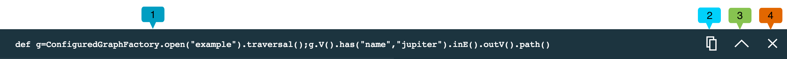
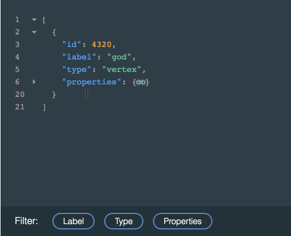
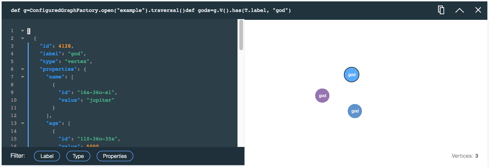
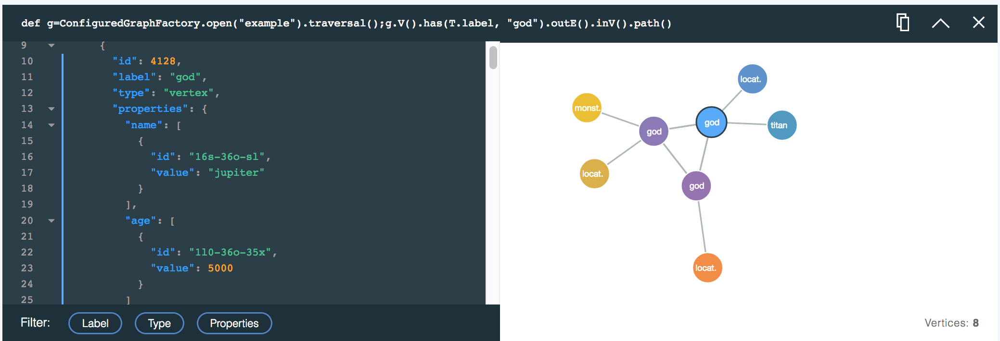

---

copyright:
  years: 2017,2018
lastupdated: "2017-09-01"
---

{:new_window: target="_blank"}
{:shortdesc: .shortdesc}
{:screen: .screen}
{:codeblock: .codeblock}
{:pre: .pre}
{:tip: .tip}

# JanusGraph 데이터 브라우저 사용

명령행에서 그래프 데이터를 탐색하는 것은 복잡한 태스크일 수 있으며 순회를 형성하는 것은 어려울 수 있습니다. 텍스트 또는 JSON 출력으로 리턴되는 결과를 이해하기 쉬운 그래프 관계의 관점에서 시각화하는 것은 어려울 수 있습니다. 이러한 상황에서 JanusGraph on Compose용 브라우저가 사용됩니다.

{{site.data.keyword.composeForJanusGraph_full}}용 데이터 브라우저는 사용하기 쉬운 조회 빌더와 빌더 아래에 쌓이는 풍부한 조회 응답 카드를 결합합니다. 각 카드는 조회를 기록하며 결과를 대화식 JSON 보기로 표시하고 JSON 보기와 상대적으로 탐색할 수 있는 시각화된 그래프로도 표시합니다. 각 카드는 다음 조회를 세분화하는 데 도움이 될 수 있습니다.

## 데이터 브라우저 시작하기

데이터 브라우저에 대한 링크는 서비스의 _대시보드 개요_ 페이지에 있습니다. 링크를 클릭하여 인터페이스를 새 브라우저 탭으로 로드하십시오.

다음은 첫 번째 조회가 실행된 후의 데이터 브라우저 보기입니다.


조회를 작성, 편집 및 실행할 때 데이터 브라우저에 조회 빌더 **(1)**가 표시합니다. 조회 빌더 아래에는 조회 응답 카드 **(2)**가 있습니다. 새 카드는 카드 스택의 맨 위에 삽입됩니다. 이전에 맨 위에 있던 카드는 브라우저를 실행할 때 표시되는 브라우저에 대한 대화식 소개 **(3)**였습니다.

## 조회 빌더

조회 빌더는 Gremlin 스크립트를 작성하는 데 도움이 되는 구문 강조표시 기능이 있는 다중 행 편집기입니다.


## 응답 카드 및 응답 카드 스택

각 조회는 조회, JSON 응답 및 조회 결과의 그래프 시각화(사용 가능한 경우)를 포함하는 응답 카드를 생성합니다. 각 카드의 맨 위에 실행된 조회가 표시됩니다.



카드에는 실행된 조회 **(1)**, **복사** 단추 **(2)**, **접기**/**펼치기** 단추 **(3)** 및 **닫기** 단추 **(4)**가 표시됩니다.

더 많은 조회가 실행되면 각 조회가 새 응답 카드를 생성하고 최신 응답 카드가 가장 먼저 표시됩니다. 페이지가 길어지거나 데이터 브라우저 성능 감소를 감지하는 경우 **접기** 단추를 사용하여 일부 프레임을 저장할 수 있습니다. 카드에 더 이상의 결과가 필요하지 않으면 완전히 닫을 수 있습니다. 응답 카드를 닫아도 그래프 데이터가 삭제되지 않습니다.

## 조회 응답: JSON 뷰어

JSON 뷰어는 응답의 구문이 강조표시된 텍스트 보기입니다. 결과를 탐색하는 데 도움이 되도록 행에 번호가 매겨집니다. JSON 문서가 중첩된 경우 작은 화살표가 표시됩니다. 화살표를 클릭하여 중첩된 섹션을 접을 수 있습니다.



또한 JSON 보기에는 표시되는 정보를 관리하기 위해 적용할 수 있는 필터가 포함되어 있습니다. 필터를 선택하려면 **레이블**, **유형** 및 **특성** 단추를 클릭하십시오. 여러 필터를 선택할 수 있습니다.


## 조회 응답: Visualizer

조회 결과를 시각화할 수 있는 경우 조회 응답의 정점과 에지를 나타내는 그래프가 카드에 표시됩니다. 해당 특성을 보려면 정점을 클릭하십시오. 정점을 클릭한 후 끌어서 이동하고 제 위치에 고정할 수 있습니다.

예를 들어, The Graph of the Gods 샘플 데이터베이스를 사용하여 레이블이 'God'인 정점을 찾는 조회는 다음과 같습니다.

```groovy
def g=ConfiguredGraphFactory.open("example").traversal();
g.V().has(T.label, "god");
```

이 조회는 신을 나타내는 모든 정점을 그래프에 표시하여 다음과 같은 응답 카드와 시각화를 생성합니다.



다음 조회는 'god' 정점을 해당 정점에서 나가는 에지 및 해당 에지가 이동하는 정점과 함께 표시하는 결과를 생성합니다.

```groovy
def g=ConfiguredGraphFactory.open("example").traversal();
g.V().has(T.label, "god").outE().inV().path();
```

조회 결과의 그래프 시각화는 다음과 같습니다.



### .path() 명령

Visualizer는 JSON 뷰어에 표시되는 JSON 결과를 렌더링하므로 리턴된 정점 및 에지만 시각화됩니다. 조회 라우트가 정점만 순회하는 경우 정점만 리턴되지만 에지를 포함하는 경우에는 해당 에지도 결과에 포함됩니다. 결과를 에지로 채우는 여러 가지 방법이 있습니다. 강력한 방법은 `path()` 함수를 사용하는 것입니다. Gremlin 조회에 추가된 경우 `path()`는 조회 응답에서 정점에 이르기 위해 선택한 라우트를 리턴합니다.

[path-step](http://tinkerpop.apache.org/docs/current/reference/#path-step)에 대한 Gremlin 문서에 `path()` 함수와 관련된 자세한 정보가 있습니다.
{: .tip}

예를 들어, 다음 조회는 정점만 리턴합니다.

```groovy
def g=ConfiguredGraphFactory.open("example").traversal();
g.V().outE().inV()
```

결과 시각화에도 정점만 포함됩니다.


`path()`를 동일한 조회에 추가하여 조회 응답을 변경할 수 있습니다.

```groovy
def g=ConfiguredGraphFactory.open("example").traversal();
g.V().outE().inV().path()
```

이제 조회는 정점과 에지를 모두 포함하는 응답을 생성합니다.


## 'null' 결과 처리

브라우저의 일부 명령이 `null` 결과를 리턴할 수 있습니다. 리턴하는 값이 현재 직렬화 가능하지 않은 경우에 이러한 상황이 발생할 수 있습니다. 가장 일반적인 예는 `ConfiguredGraphFactory` 클래스의 `open` 및 `create` 메소드를 포함하여 그래프를 리턴하는 명령 또는 표현식입니다. `null` 응답이 표시되지만 실제 값은 JanusGraph 내에 그대로 유지되고 조회에 사용할 수 있습니다. `ConfiguredGraphFactory`를 사용하는 경우 정점 및 에지를 리턴하도록 명령을 확장하여 JSON 응답이 리턴되도록 하십시오.
