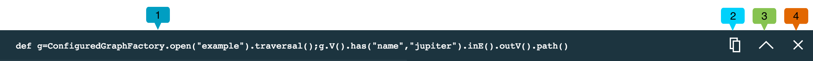

---

copyright:
  years: 2017
lastupdated: "2017-09-01"
---

{:new_window: target="_blank"}
{:shortdesc: .shortdesc}
{:screen: .screen}
{:codeblock: .codeblock}
{:pre: .pre}
{:tip: .tip}

# Usando o Data Browser do JanusGraph

Explorar seus dados do gráfico por meio da linha de comandos pode ser uma tarefa complexa e pode ser difícil formar as passagens. Pode ser difícil visualizar os resultados, retornados como texto ou saída JSON, em termos de relacionamentos de gráfico compilável. É aqui que o navegador para JanusGraph no Compose entra.

O Data Browser for {{site.data.keyword.composeForJanusGraph_full}} combina um Gerador de Consultas fácil de usar com Cartões de resposta de consulta detalhados que são empilhados abaixo do construtor. Cada cartão registra a consulta e exibe os resultados como uma visualização JSON interativa e como um gráfico visualizado que podem ser explorados com relação à visualização JSON. Cada cartão pode ajudar a refinar sua próxima consulta.

## Introdução ao Data Browser

O link para o Data Browser está localizado na página _Visão geral do painel_ de seu serviço. Clique no link para carregar a interface em uma nova guia do navegador.

Esta é uma visualização do Data Browser depois que uma primeira consulta foi executada.


O Data Browser mostra o Gerador de Consultas **(1)**, no qual você cria, edita e executa suas consultas. Abaixo do Gerador de Consultas, há um Cartão de resposta de consulta **(2)**. Os novos cartões são inseridos na parte superior da pilha de cartões. O cartão superior anterior era a introdução interativa ao navegador **(3)**, que é exibida quando você ativa o navegador.

## O Gerador de Consultas

O Gerador de Consultas é um editor multilinhas com destaque da sintaxe para ajudar a editar os scripts Gremlin.


## Cartões de resposta e a pilha de cartões de resposta

Cada consulta gera um cartão de resposta que contém sua consulta, uma resposta JSON e uma visualização gráfica dos resultados da consulta, se uma estiver disponível. A parte superior de cada cartão exibe a consulta que foi executada.



O cartão exibe a consulta que foi executada **(1)**, o botão **Copiar** **(2)**, o botão **Reduzir**/**Expandir** **(3)** e o botão **Fechar** **(4)**.

Conforme você executa mais consultas, cada uma gera um novo cartão de resposta, com o cartão de resposta mais novo exibido primeiro. Se a página fica muito longa ou você observa que o desempenho do Data Browser está diminuindo, é possível usar o botão **Reduzir** para salvar alguns quadros. Se você não precisa mais dos resultados em um cartão, é possível fechá-lo completamente. Fechar um cartão de resposta não exclui nenhum dado do gráfico.

## Resposta de consulta: o visualizador JSON

O visualizador JSON é uma visualização de texto com sintaxe destacada da resposta. As linhas são numeradas para ajudá-lo a navegar pelos resultados. Onde o documento JSON é aninhado, setas pequenas são exibidas. É possível clicar nas setas para compactar as seções aninhadas:


A visualização JSON também inclui filtros que podem ser aplicados para gerenciar quais informações são exibidas. Para selecionar os filtros, clique nos botões **Rótulo**, **Tipo** e **Propriedades**. É possível selecionar múltiplos filtros.


## Resposta da consulta: o visualizador

Se seu resultado da consulta pode ser visualizado, o cartão exibe um gráfico mostrando os vértices e as bordas da resposta da consulta. Clique em um vértice para ver suas propriedades. É possível clicar e arrastar os vértices para movê-los e bloqueá-los na posição.

Por exemplo, usando o Gráfico do banco de dados de amostra Gods, uma consulta para localizar os vértices que possuem o rótulo 'God' seria conforme a seguir:

```groovy
def g=ConfiguredGraphFactory.open("example").traversal();
g.V().has(T.label, "god");
```

A consulta produz o cartão de resposta e a visualização a seguir, mostrando todos os vértices no gráfico que representam os gods:


A consulta a seguir produz um resultado que mostra os vértices 'god' juntamente com quaisquer bordas sairão deles e os vértices nos quais essas bordas entrarão:

```groovy
def g=ConfiguredGraphFactory.open("example").traversal();
g.V().has(T.label, "god").outE().inV().path();
```

A visualização de gráfico dos resultados da consulta é semelhante a esta:


### O comando .path()

O visualizador renderiza os resultados do JSON mostrados no visualizador JSON, então somente os vértices e bordas retornados são visualizados. Se a rota de consulta atravessa somente os vértices, então somente vértices são retornados, mas se isso inclui bordas, elas são incluídas nos resultados. Há várias maneiras de preencher os resultados com bordas. Um método eficiente é usar a função `path()`. Quando incluído em uma consulta Gremlin, o `path()` retorna a rota tomada para chegar aos vértices na resposta da consulta.

A documentação do Gremlin sobre [path-step](http://tinkerpop.apache.org/docs/current/reference/#path-step) tem mais sobre a função `path()`.
{: .tip}

Por exemplo, a consulta a seguir retorna somente vértices:

```groovy
def g=ConfiguredGraphFactory.open("example").traversal();
g.V().outE().inV()
```

A visualização resultante também contém somente vértices.


É possível alterar a resposta da consulta incluindo `path()` na mesma consulta.

```groovy
def g=ConfiguredGraphFactory.open("example").traversal();
g.V().outE().inV().path()
```

A consulta agora produz uma resposta que contém vértices e bordas.


## Manipulando resultados 'null'

Alguns comandos no navegador podem retornar um resultado `null`. Isso pode acontecer quando o valor que eles retornam não é atualmente serializável. O exemplo mais comum é qualquer comando ou expressão que retorna um gráfico, incluindo os métodos `open` e `create` da classe `ConfiguredGraphFactory`. Embora uma resposta `null` seja exibida, os valores reais estão intactos no JanusGraph e estão disponíveis para uso em uma consulta. Ao usar `ConfiguredGraphFactory`, estenda seu comando para retornar vértices e bordas para assegurar que uma resposta JSON seja retornada.
