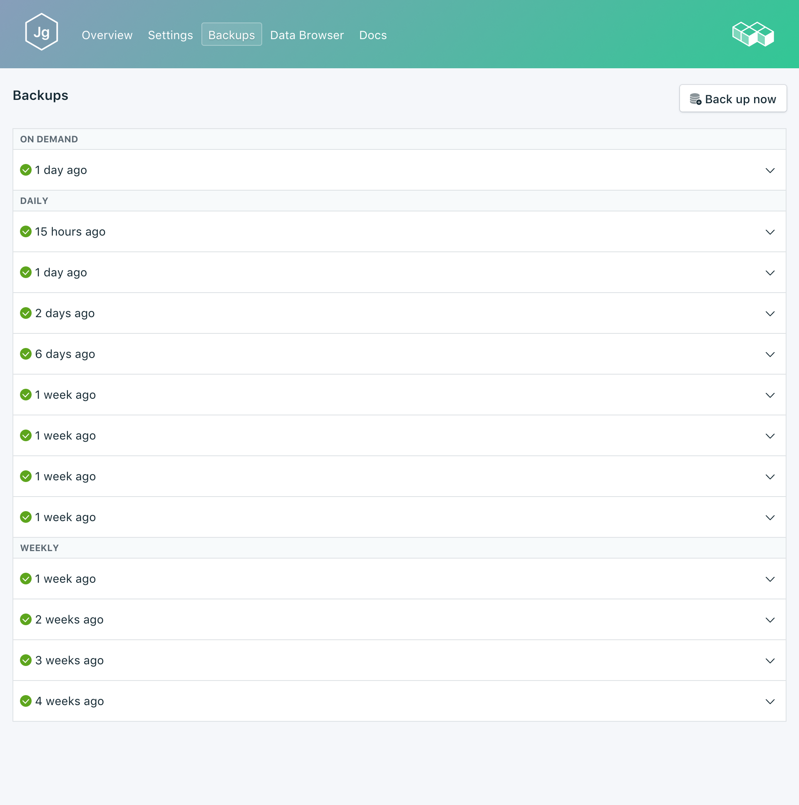
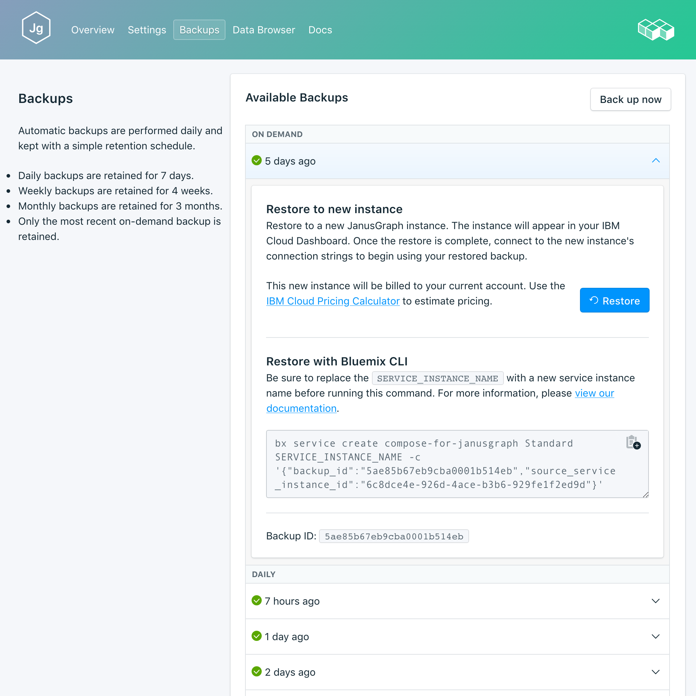

---

copyright:
  years: 2017
lastupdated: "2017-10-16"
---

{:new_window: target="_blank"}
{:shortdesc: .shortdesc}
{:screen: .screen}
{:codeblock: .codeblock}
{:pre: .pre}

# 备份
{: #backups}

您可以从服务仪表板*管理*页面的_备份_选项卡创建和下载备份。可以使用安排的备份和手动备份。

备份是通过备份 Sylla 数据库节点而创建的。Scylla 备份使用 Scylla 快照实用程序进行，会备份在数据目录中存储的所有磁盘上数据文件。快照可以在数据库处于在线状态时运行。

## 查看现有备份

数据库的每日备份会自动安排。要查看现有备份：

1. 浏览至服务仪表板的_管理_页面。
2. 单击选项卡中的**备份**以打开_备份_页面。此时将显示可用备份的列表，而最新的备份位于列表顶部：

  

单击相应的行以展开任何可用备份的选项。
   

## 创建手动备份

除了已安排的备份，您还可以手动创建备份。要创建手动备份，请执行以下步骤以查看现有备份，然后单击可用备份列表上方的**现在备份**。此时将显示一条消息，通知您已启动备份，并且“暂挂”备份将添加到可用备份列表中。

## 复原备份
要将备份复原到新服务实例，请执行以下步骤以查看现有备份，然后单击相应的行以展开要下载的备份的选项。单击**复原**按钮。此时将显示一条消息，通知您已启动复原。新服务实例将自动命名为“janusgraph-restore-[timestamp]”，并在供应启动时显示在仪表板上。
