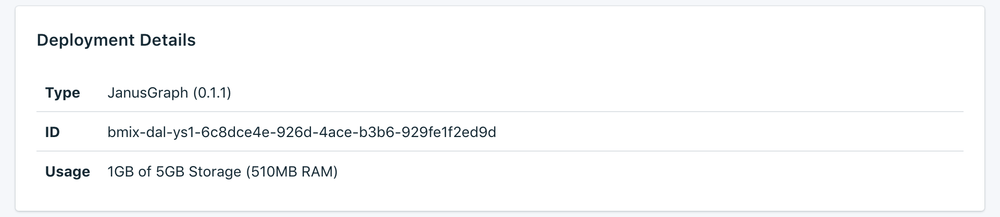

---

Copyright:
  years: 2017,2018
lastupdated: "2018-05-07"
---

{:new_window: target="_blank"}
{:shortdesc: .shortdesc}
{:screen: .screen}
{:codeblock: .codeblock}
{:pre: .pre}

# 服务概述

_概述_页面显示有关 {{site.data.keyword.cloud}} Compose 数据库的信息。此概述包含基本的标识信息和当前资源使用情况。您还将找到一个用于连接字符串的部分，您可以将这些连接字符串与工具一起使用，也可以使用工具来连接到数据库。

## 部署详细信息

_部署详细信息_面板显示服务的详细信息。

### 类型

服务所提供的数据库类型，以及服务所使用的数据库版本。如果有更新的数据库版本可用，那么会显示通知以及指向服务仪表板中[升级版本](/docs/services/ComposeForJanusGraph/dashboard-settings.html#upgrade-version)部分的链接。

### 标识

服务的内部标识。

### 使用情况

数据库的大小和服务套餐所提供的存储量。

## 当前作业

对服务进行管理更改（例如，扩展或执行手动备份）会启动作业。作业正在运行时，_当前作业_面板会显示在_概述_页面上，其中显示作业名和进度条。作业完成后，_当前作业_面板即不会再显示在_概述_页面上。

## 连接字符串

连接字符串可由某些客户机库使用，并包含其他库连接所需的所有信息。您可以在[连接外部应用程序](./connecting-external.html)中找到如何使用“连接字符串”连接到服务的信息。

您将在_连接字符串_面板的其他选项卡中找到服务的每个“连接字符串”。

### 会话

您可以使用会话 URI 来获取有效期为 60 分钟的授权令牌。使用 HTTPS 或 Websocket URI 对部署进行调用时，应该使用所提供的令牌。

### HTTPS

这是 JanusGraph 部署的基本连接字符串。要使用 HTTPS 连接字符串，您需要提供管理用户凭证以连接到服务器。有关如何使用 HTTPS 的详细信息，请参阅[使用 HTTPS 创建和遍历图形](./tutorial-https.html)。

### Websocket

Websocket URI 可用于建立具有 JanusGraph 部署的长时间运行的会话。它们以 `wss:` 为前缀，以表示连接使用安全的 HTTPS。这些连接字符串需要将基本认证与管理员用户凭证配合使用，以连接到服务器。

对于使用 WebSocket 作为其与服务器的连接的 JanusGraph，存在许多库；要使用 {{site.data.keyword.composeForJanusGraph}}，它们必须能够执行基本认证和使用 WSS（安全 WebSocket over TLS）。

### Gremlin Console YAML

使用 Gremlin Console，您可以利用所提供的任何配置，来连接到 {{site.data.keyword.composeForJanusGraph}}。有关如何使用 Gremlin Console YAML 的详细信息，请参阅[使用 Gremlin Console 创建和遍历图形](./tutorial-gremlin-console.html)。

## 实例管理 API

您可以通过 {{site.data.keyword.cloud_notm}} Compose API 来管理 {{site.data.keyword.composeForJanusGraph}} 服务。

### 基础端点

基础端点由服务所在的区域和服务实例标识组成。基础端点将位于每个端点的开头。

### 部署标识

部署标识对于大多数调用都是必需的，用于标识特定的部署实例。

### 参考

有关在所有 {{site.data.keyword.cloud_notm}} Compose 服务上使用 {{site.data.keyword.cloud_notm}} Compose API 的更多文档和参考信息，请参阅 [{{site.data.keyword.cloud_notm}} Compose API](https://www.compose.com/articles/the-ibm-cloud-compose-api/)。
