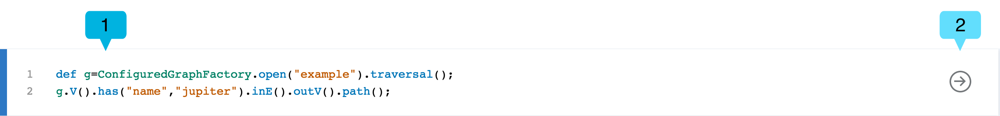
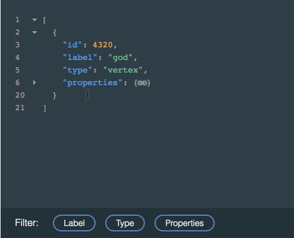
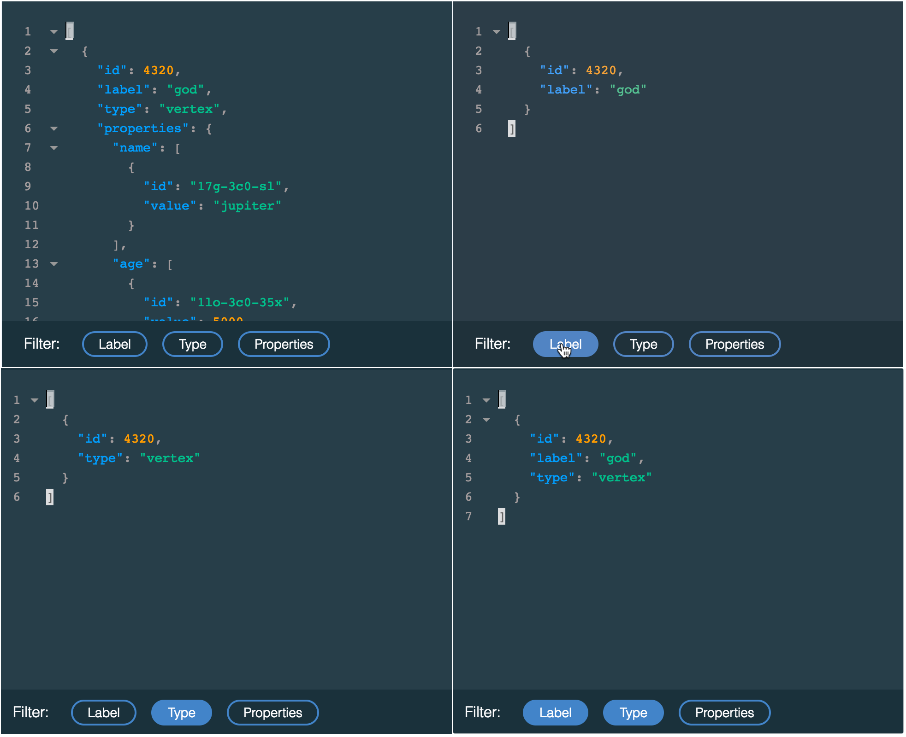
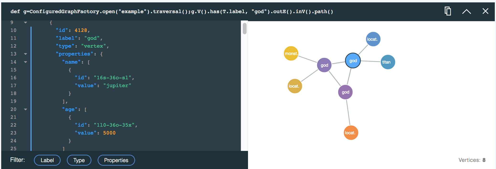
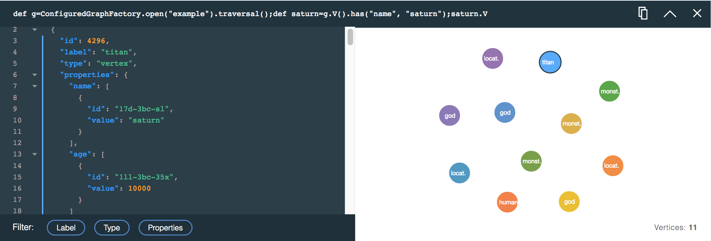

---

copyright:
  years: 2017
lastupdated: "2017-09-01"
---

{:new_window: target="_blank"}
{:shortdesc: .shortdesc}
{:screen: .screen}
{:codeblock: .codeblock}
{:pre: .pre}
{:tip: .tip}

# 使用 JanusGraph 数据浏览器

通过命令行探查图形数据可能是一项复杂任务，并且可能难以形成遍历。通过可摘要的图形关系对以文本或 JSON 输出返回的结果进行直观显示可能很难。这时，就需要 JanusGraph on Compose 的浏览器。

{{site.data.keyword.composeForJanusGraph_full}} 的数据浏览器将一个简单易用的查询构建器与该构建器下的富查询响应卡组合在一起。每张卡都会记录查询，并以交互 JSON 视图和可浏览的直观图形（相对于 JSON 视图）显示结果。每张卡都可以帮助您优化下一个查询。

## 数据浏览器入门

数据浏览器的链接位于服务的_仪表板概述_页面上。单击此链接可将界面装入到新的浏览器选项卡中。

这是运行第一个查询后的数据浏览器视图。


数据浏览器显示查询构建器 **(1)**，您可以在其中创建、编辑和执行查询。查询构建器下面是查询响应卡 **(2)**。新卡将插入在卡堆栈的顶部。前一张卡是浏览器 **(3)** 的交互简介，在您启动浏览器时显示。

## 查询构建器

查询构建器是一个多行编辑器，其语法会突出显示，可帮助您编写 Gremlin 脚本。



## 响应卡和响应卡堆栈

每个查询都会生成一个响应卡，其中包含查询、JSON 响应以及查询结果的图形可视化（如果有的话）。每个卡的顶部会显示已运行的查询。


卡会显示已经运行的查询 **(1)**、**复制**按钮 **(2)**、**折叠**/**展开**按钮 **(3)** 和**关闭**按钮 **(4)**。

当您运行更多查询时，每个查询都会生成一个新响应卡，首先显示最新的响应卡。如果页面很长，或者您注意到数据浏览器性能下降，那么可以使用**折叠**按钮来节省一些框架。如果您不再需要卡上的结果，那么可以将其完全关闭。关闭响应卡不会删除任何图形数据。

## 查询响应：JSON 查看器

JSON 查看器是响应的语法突出显示的文本视图。这些行将进行编号，以帮助您浏览结果。当 JSON 文档嵌套时，会显示小箭头。您可以单击箭头以折叠嵌套的部分：



JSON 视图还包含可应用以管理显示哪些信息的过滤器。要选择过滤器，请单击**标签**、**类型**和**属性**按钮。您可以选择多个过滤器。



## 查询响应：可视化器

如果可以可视化查询结果，那么卡会显示一个图形，其中显示查询响应的顶点和边。单击顶点以查看其属性。您可以单击并拖动顶点以将其四处移动，并将其锁定到位。

例如，使用“The Graph of the Gods”样本数据库，查找标签为“God”的顶点查询将如下所示：

```groovy
def g=ConfiguredGraphFactory.open("example").traversal();
g.V().has(T.label, "god");
```

该查询生成以下响应卡和可视化，显示代表 God 的图形中的所有顶点：


以下查询将生成一个结果，该结果显示“God”顶点连同从这些顶点出来的任何边，以及这些边达到的顶点：

```groovy
def g=ConfiguredGraphFactory.open("example").traversal();
g.V().has(T.label, "god").outE().inV().path();
```

查询结果的图形可视化如下所示：



### .path() 命令

可视化器将呈现 JSON 查看器中显示的 JSON 结果，因此仅会将返回的顶点和边可视化。如果查询路径仅遍历顶点，那么仅会返回顶点，但如果它包含边，那么将在结果中包含这些边。有多种方法可用边来填充结果。功能强大的方法是使用 `path()` 函数。添加到 Gremlin 查询时，`path()` 会返回要到达查询响应中的顶点的路径。

[path-step](http://tinkerpop.apache.org/docs/current/reference/#path-step) 上的 Gremlin 文档具有 `path()` 函数的更多信息。
{: .tip}

例如，以下查询仅返回顶点：

```groovy
def g=ConfiguredGraphFactory.open("example").traversal();
g.V().outE().inV()
```

产生的可视化也仅包含顶点。



您可以通过将 `path()` 添加到同一个查询来变更查询响应。

```groovy
def g=ConfiguredGraphFactory.open("example").traversal();
g.V().outE().inV().path()
```

现在，查询将生成同时包含顶点和边的响应。


## 处理“null”结果

浏览器中的某些命令可能会返回 `null` 结果。当它们返回的值当前不可序列化时，会发生这种情况。最常见的示例是返回图形的任何命令或表达式，包括 `ConfiguredGraphFactory` 类的 `open` 和 `create` 方法。虽然会显示 `null` 响应，但实际值在 JanusGraph 中是完整无缺的且可供在查询中使用。使用 `ConfiguredGraphFactory` 时，请扩展命令以返回顶点和边，从而确保返回 JSON 响应。
