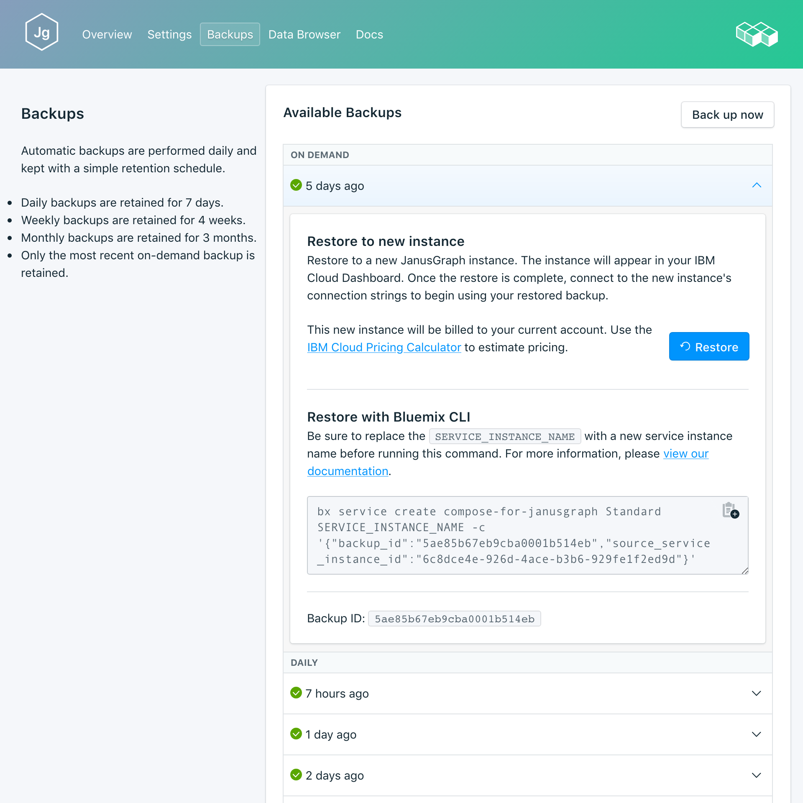

---

copyright:
  years: 2017
lastupdated: "2017-10-16"
---

{:new_window: target="_blank"}
{:shortdesc: .shortdesc}
{:screen: .screen}
{:codeblock: .codeblock}
{:pre: .pre}

# 備份
{: #backups}

您可以從服務儀表板的*管理* 頁面的_備份_ 標籤中，建立及下載備份。提供有排程備份及手動備份。

備份是透過備份 Snylla 資料庫節點而建立的。Snylla 備份是使用 Snylla Snapshot 公用程式取得的，其會備份資料目錄中儲存的所有磁碟內存資料檔。Snapshot 可以在資料庫處於線上狀態時執行。

## 檢視現有備份

資料庫的每日備份是自動排定的。若要檢視現有備份，請執行下列動作：

1. 導覽至服務儀表板的_管理_ 頁面。
2. 按一下標籤中的**備份**，以開啟_備份_ 頁面。即會顯示可用備份的清單，最新備份位於清單頂端：

  

按一下對應列來展開任何可用備份的選項。
   

## 建立手動備份

除了排程備份外，您也可以手動建立備份。若要建立手動備份，請遵循步驟來檢視現有備份，然後在可用備份的清單上方按一下**立即備份**。即會顯示一則訊息，讓您知道已起始備份，且已將「擱置」備份新增至可用備份的清單。

## 還原備份
若要將備份還原至新的服務實例，請遵循步驟來檢視現有備份，然後按一下對應列以展開您要下載之備份的選項。按一下**還原**按鈕。即會顯示一則訊息，讓您知道已起始還原。新的服務實例會自動命名為 "janusgraph-restore-[timestamp]"，而且在佈建開始時，儀表板上會出現這個實例。
