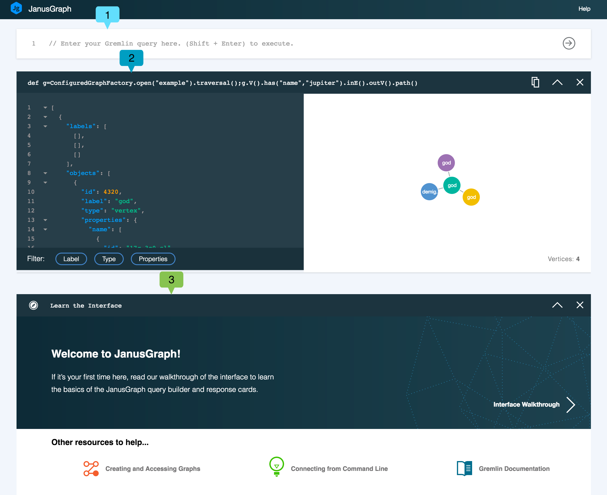
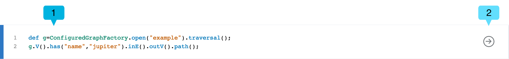

---

copyright:
  years: 2017
lastupdated: "2017-09-01"
---

{:new_window: target="_blank"}
{:shortdesc: .shortdesc}
{:screen: .screen}
{:codeblock: .codeblock}
{:pre: .pre}
{:tip: .tip}

# 使用 JanusGraph 資料瀏覽器

從指令行探索圖形資料可能是複雜的作業，並且可能很難構成遍訪。可能難以將結果視覺化，並依據可摘要的圖形關係，以文字或 JSON 輸出傳回。這便是 Browser for JanusGraph on Compose 參與的地方。

Data Browser for {{site.data.keyword.composeForJanusGraph_full}} 結合了易於使用的「查詢建置器」，以及堆疊在建置器下方的豐富「查詢回應卡」。每張卡片會記錄查詢，並將結果顯示為互動式 JSON 視圖與視覺化圖形。相較於 JSON 視圖，您可以探索視覺化圖形。每張卡片都可協助您修正下一次的查詢。

## 開始使用資料瀏覽器

「資料瀏覽器」的鏈結位於服務的_儀表板概觀_ 頁面。請按一下鏈結以將介面載入至新的瀏覽器分頁。

這是第一個查詢執行之後的「資料瀏覽器」視圖。



「資料瀏覽器」顯示「查詢建置器」**(1)**，在這裡您會建立、編輯與執行您的查詢。「查詢建置器」底下是「查詢回應卡」**(2)**。新的卡片會插入在卡片堆疊之上。前一張最上層卡片是瀏覽器的互動式簡介 **(3)**，它會在您啟動瀏覽器時顯示。

## 查詢建置器

「查詢建置器」是多行的編輯器，具有語法強調顯示可協助您組合 Gremlin Script。



## 回應卡與回應卡堆疊

每個查詢都會產生一張回應卡，其中包含您的查詢、JSON 回應以及查詢結果的圖形視覺效果（如果有的話）。每張卡片的頂端會顯示已執行的查詢。


卡片顯示已執行的查詢 **(1)**、**複製**按鈕 **(2)**、**收合**/**展開**按鈕 **(3)**，以及**關閉**按鈕 **(4)**。

隨著您執行更多查詢，每個查詢會產生新的回應卡，並且會先顯示最新的回應卡。如果頁面變長，或是您注意到「資料瀏覽器」效能遞減，則可以使用**收合**按鈕以節省一些頁框。如果您不再需要卡片上的結果，可以完全關閉它。關閉回應卡不會刪除任何圖形資料。

## 查詢回應：JSON 檢視器

JSON 檢視器是回應的語法強調顯示文字視圖。各行會加以編號，以協助您導覽結果。如果 JSON 文件為巢狀組織，則會顯示小箭頭。您可以按一下箭頭收合巢狀區段：


JSON 視圖也包含可以套用以管理所顯示資訊的過濾器。若要選取過濾器，請按一下**標籤**、**類型**及**內容**按鈕。您可以選取多個過濾器。


## 查詢回應：視覺化工具

如果您的查詢結果可以視覺化，卡片會顯示圖形，圖形中顯示來自查詢回應的頂點和邊緣。請按一下頂點以查看其內容。您可以按一下並拖曳頂點，將它們四處移動，以及鎖定至定位。

例如，使用 The Graph of the Gods 範例資料庫，尋找具有標籤 'God' 之頂點的查詢如下：

```groovy
def g=ConfiguredGraphFactory.open("example").traversal();
g.V().has(T.label, "god");
```

查詢會產生下列回應卡及視覺效果，並顯示圖形中代表神祇的所有頂點：


下列查詢所產生的結果，會顯示 'god' 頂點，以及出自於它們的任何邊緣，以及那些邊緣進入的頂點：

```groovy
def g=ConfiguredGraphFactory.open("example").traversal();
g.V().has(T.label, "god").outE().inV().path();
```

查詢結果的圖形視覺效果看起來類似：


### .path() 指令

視覺化工具會呈現 JSON 檢視器中顯示的 JSON 結果，因此只有傳回的頂點和邊緣會視覺化。如果查詢路徑只會遍訪頂點，則只會傳回頂點，但如果包含邊緣，這些都會包含在結果中。有許多方式可在結果中移入邊緣。一項強大的方法就是使用 `path()` 函數。新增至 Gremlin 查詢時，`path()` 會傳回到達查詢回應中之頂點的路徑記號。

關於 [path-step](http://tinkerpop.apache.org/docs/current/reference/#path-step) 的 Gremlin 文件有 `path()` 函數的更多資訊。
{: .tip}

例如，下列查詢只會傳回頂點：

```groovy
def g=ConfiguredGraphFactory.open("example").traversal();
g.V().outE().inV()
```

產生的視覺效果也只包含頂點。


您可以將 `path()` 新增至相同查詢，以變更查詢回應。

```groovy
def g=ConfiguredGraphFactory.open("example").traversal();
g.V().outE().inV().path()
```

查詢現在會產生回應，其中包含頂點與邊緣。


## 處理 'null' 結果

瀏覽器中的部分指令可能傳回 `null` 結果。這可能會在它們傳回的值目前無法序列化時發生。最常見的範例是傳回圖形的任何指令或表示式，包括 `ConfiguredGraphFactory` 類別的 `open` 及 `create` 方法。雖然畫面上顯示 `null` 回應，但實際值在 JanusGraph 內不受影響，且可以用於查詢。使用 `ConfiguredGraphFactory` 時，請延伸您的指令，以傳回頂點和邊緣，確保傳回 JSON 回應。
